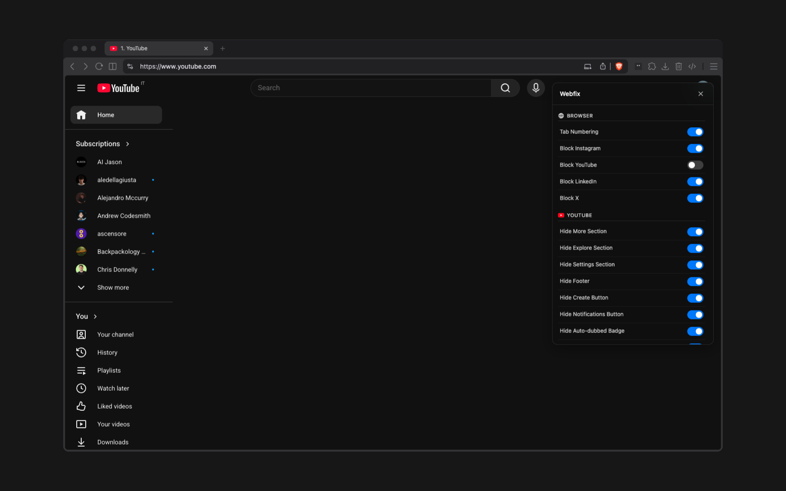

# Webfix

[](LICENSE)


[](https://github.com/umbertotancorre/webfix)



**No Account · No Server · No Tracking**

A browser extension that removes clutter from YouTube, LinkedIn, Gmail, Google Calendar, and X. All features are toggleable from a popup.

## Table of Contents

- [Features](#features)
  - [Browser](#browser)
  - [YouTube](#youtube)
  - [LinkedIn](#linkedin)
  - [Gmail](#gmail)
  - [Google Calendar](#google-calendar)
  - [X (Twitter)](#x-twitter)
- [Browser Compatibility](#browser-compatibility)
- [Installation](#installation)
- [Build Your Own Version](#build-your-own-version)
  - [Project Structure](#project-structure)
- [License](#license)

## Features

### Browser
- Number open tabs in the title bar (`1. Page Title`, `2. Page Title`, ...), updating live when tabs are added, moved, or removed
- Block Instagram, YouTube, LinkedIn, or X entirely (redirects to `about:blank`)

### YouTube
- Hide Shorts (sidebar entries, feed shelves, search results, and video cards)
- Hide the Explore, More from YouTube, and Settings sidebar sections
- Hide sidebar footer, Create button, and Notifications button
- Hide Auto-dubbed badges and "Your watch history is off" nudges
- Hide video suggestions panel on watch pages
- Press `S` to focus the search bar from anywhere on the page

### LinkedIn
- Press `S` to focus the search bar from anywhere on the page

### Gmail
- Hide the Upgrade button

### Google Calendar
- Hide Booking Pages section, Support button, side panel toggle, Create button, view switcher, and Today navigation button
- Hide mini-month calendar, Search for People panel, Birthdays calendar, and Tasks calendar from the sidebar
- Hide Calendar/Tasks switcher icon
- Hide Terms and Privacy footer

### X (Twitter)
- Hide individual left nav items: Logo, Home, Explore, Notifications, Follow, Messages, Grok, Premium, Bookmarks, Creator Studio, Articles, Profile, More
- Center the left nav sidebar vertically
- Float the Post button to the bottom-right corner
- Shift the main timeline column to the right
- Hide the Trending and Who to Follow right sidebar
- Hide the Grok drawer button and the Chat drawer button

## Browser Compatibility

Works on all Chromium-based browsers:

| Browser | Install page |
|---------|-------------|
| Google Chrome | `chrome://extensions` |
| Microsoft Edge | `edge://extensions` |
| Brave | `brave://extensions` |
| Opera | `opera://extensions` |
| Vivaldi | `vivaldi://extensions` |
| Arc | `arc://extensions` |
| Comet | `chrome://extensions` |
| Chromium | `chromium://extensions` |


## Installation

1. Clone or download this repository.
2. Open the extensions page for your browser (see table above) and enable **Developer mode**.
3. Click **Load unpacked** and select the repository folder.

The extension icon appears in the toolbar. Click it to open the settings popup and toggle any feature on or off.

## Build Your Own Version

Webfix is intentionally simple to fork and extend. If there is a site you use daily with UI you find annoying, you can add your own rules in a few steps.

**1. Find what you want to remove.**
Open the site in your browser, right-click the element that bothers you, and select **Inspect**. In the DevTools panel you can read the element's tag, class names, attributes, and surrounding structure.

**2. Write a hide function.**
Add a new function in the relevant content script (or create a new file for a new site). The pattern is always the same: query the element, check a setting, set `display: none`.

```js
async function hideExampleBanner() {
  const enabled = await getSetting('example', 'hideBanner');
  if (!enabled) return;
  const el = document.querySelector('.annoying-banner');
  if (el) el.style.display = 'none';
}
```

**3. Register the setting.**
Add a default value in `content/settings.js` and a toggle row in the `popupConfig` array in `content/popup.js` so it appears in the popup.

**4. Call the function.**
Add it to the `run*` function for that site (or create one and call it from `content/main.js`).

Reload the extension from the extensions page after each change and test on the live site.

### Project Structure

```
webfix/
├── assets/
│   ├── logo.png          # Extension icon
│   └── image.png         # README screenshot
├── content/
│   ├── main.js           # Entry point: initialises all modules
│   ├── settings.js       # Default settings, storage read/write helpers
│   ├── popup.js          # Floating settings UI (shadow DOM)
│   ├── blocker.js        # Site blocker (runs before DOM loads)
│   ├── tab-numbering.js  # Tab title numbering
│   ├── utils.js          # Shared helpers
│   ├── youtube.js        # YouTube tweaks
│   ├── linkedin.js       # LinkedIn tweaks
│   ├── gmail.js          # Gmail tweaks
│   ├── google-calendar.js# Google Calendar tweaks
│   └── x.js              # X (Twitter) tweaks
├── icons/
│   ├── browser.svg       # Browser section icon in popup
│   └── cross.svg         # Close button icon in popup
├── background.js         # Service worker: tab events and messaging
└── manifest.json         # Chrome extension manifest (MV3)
```

## License

`@umbertotancorre/webfix` is fully open source, licensed under the [MIT License](LICENSE).
